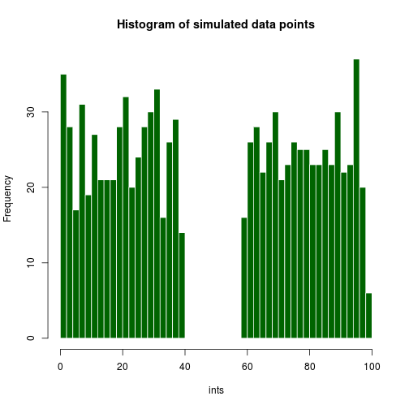
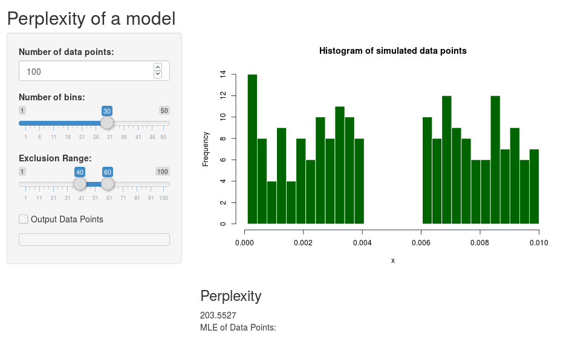

## Developing Data Products Course Project

### Estimating the Perplexity of a Probabilistic Model

---

## Perplexity Background

Perplexity is defined as 2 raised to the Cross-Entropy:

2^(-logq(x)*q(x))

--- 
## Perplexity Maximization

The perplexity is maximized when the events are equiprobable.  This can be shown by means of a mathematical proof.  This application lets the user simulate a number of events (modeled by random numbers), whose frequency determine their probability.  The user can choose an interval from which random numbers will not be selected (say from 40 to 60 in a 1-100 range) to make the distribution of events less equal, while still retaining the property of a probability distribution, namely that the probability of all outcomes sum to one.

---

This gap is controllable by the user:

---
Application user interface.  The perplexity of the model is updated as the sliders are moved.

